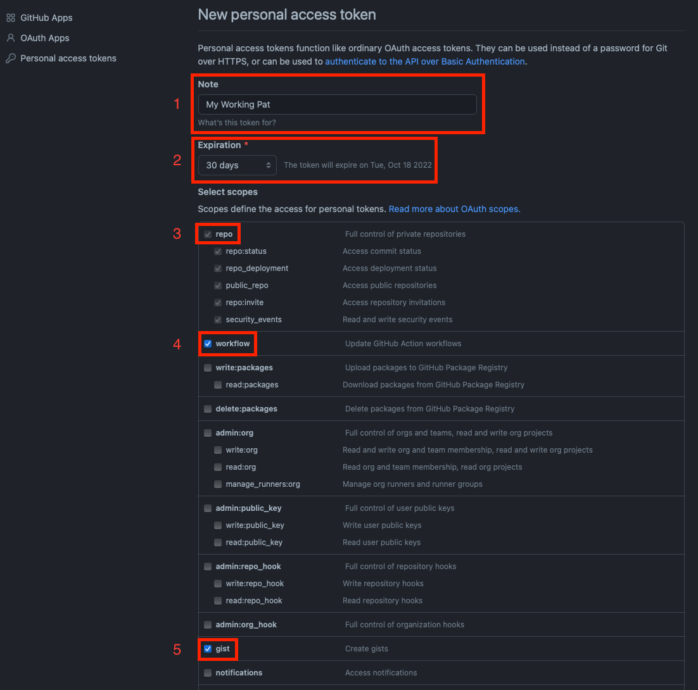
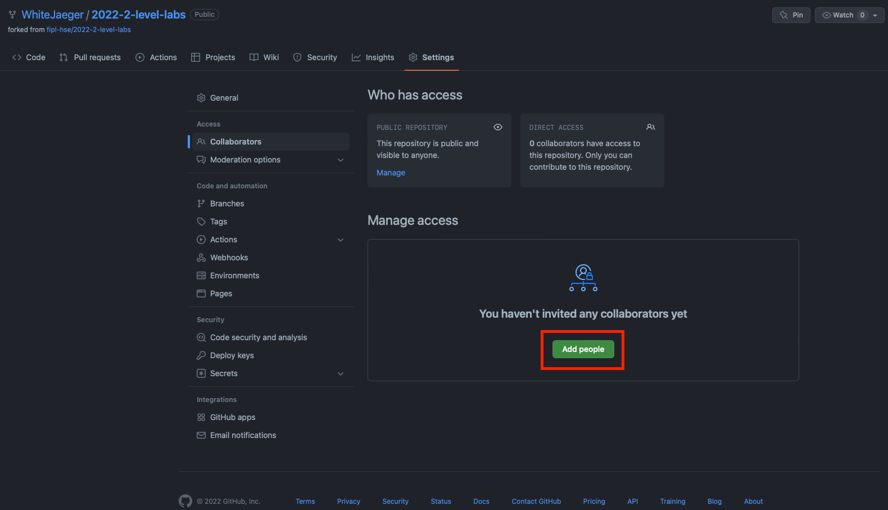
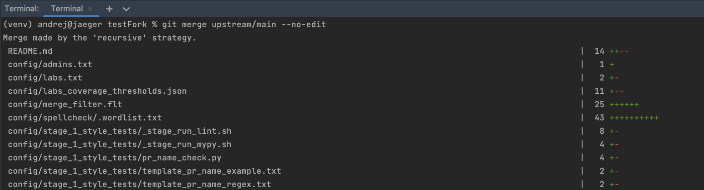

# Подготовка к прохождению курса

Перед началом прохождения курса "Программирование для лингвистов" каждому студенту необходимо сделать несколько шагов,
которые подготовят необходимые инструменты к дальнейшей работе:

1. [Установить интерпретатор языка программирования Python](#installing-python)
2. [Установить систему контроля версий Git](#installing-git)
3. [Установить среду разработки PyCharm](#installing-pycharm)
4. [Зарегистрироваться на платформе GitHub](#github-registration)
5. [Создать Personal Access Token для аутентификации](#creating-pat)
6. [Создать форк репозитория](#creating-fork)
7. [Добавить менторов в коллабораторы](#adding-collaborators)
8. [Клонировать форк репозитория для локальной работы](#cloning-fork)
9. [Создать проект в среде разработки PyCharm](#creating-project-in-pycharm)
10. [Изменить исходный код и отправить изменения в удалённый форк](#working-pipeline)
11. [Создать Pull Request](#creating-pull-request)
12. [Продолжить работу](#continue-working)

# Другие полезные инструкции
* [Обновление форка, если в основном репозитории есть изменения](#update-fork)

## Установка интерпретатора языка программирования Python

Чтобы установить интерпретатор языка программирования Python на свой компьютер, выполните следующие шаги:
1. Скачайте установочный файл для своей системы с [официального сайта](https://www.python.org/downloads/)
    
    
    * **NB**: Для скачивания нажмите кнопку `Download Python 3.XX.XX`
    * **NB №2**: Версия Python должна быть >= 3.10! 
2. Запустите установочный файл и следуйте указаниям по установке
3. Проверьте корректность установки:
   1. Откройте терминал и выполните следующую команду:
      * Mac: `python3 -V`
      * Windows: `python -V`
   2. Вы должны увидеть строку, похожую на следующую: `Python 3.10.2`

* Как открыть терминал:
  * [Инструкция для Windows](https://docs.microsoft.com/ru-ru/powershell/scripting/windows-powershell/starting-windows-powershell?view=powershell-7.2)
  * [Инструкция для MacOS](https://support.apple.com/ru-ru/guide/terminal/apd5265185d-f365-44cb-8b09-71a064a42125/mac)

## Установка системы контроля версий Git

Чтобы установить систему контроля версий Git, выполните следующие шаги:
1. Скачайте установочный файл для своей системы с [официального сайта](https://git-scm.com)
    
    
    * **NB**: Для скачивания нажмите кнопку `Download for <название ОС>`
2. Запустите установочный файл и следуйте указанием по установке
3. Проверьте корректность установки:
   1. Откройте терминал и выполните следующую команду:
      * `git`
   2. Вы должны увидеть строку, похожую на следующую: `usage: git ...`

* Как открыть терминал:
  * [Инструкция для Windows](https://docs.microsoft.com/ru-ru/powershell/scripting/windows-powershell/starting-windows-powershell?view=powershell-7.2)
  * [Инструкция для MacOS](https://support.apple.com/ru-ru/guide/terminal/apd5265185d-f365-44cb-8b09-71a064a42125/mac)

## Установка среды разработки PyCharm

Чтобы установить среду разработки PyCharm, выполните следующие шаги:
1. Скачайте установочный файл для своей системы с [официального сайта](https://www.jetbrains.com/pycharm/download/)

    
    * **NB**: Для скачивания нажмите кнопку `Download`
    * **NB №2**: Рекомендуется использовать Community Edition, так как эта версия бесплатна
    * **NB №3**: Так как Вы являетесь студентом ВШЭ, Вы можете использовать и Professional Edition, зарегистрировавшись с учебной почтой. 
      * Данная версия предоставляет [дополнительные возможности](https://www.jetbrains.com/ru-ru/products/compare/?product=pycharm&product=pycharm-ce).
2. Запустите установочный файл и следуйте указанием по установке
3. Проверьте корректность установки:
   1. Откройте PyCharm из меню приложений
   2. Вы должны увидеть похожий интерфейс:
        
       

## Регистрация на платформе GitHub

Чтобы зарегистрироваться на платформе GitHub, выполните следующие шаги:
1. Откройте [главную страницу платформы](https://github.com)
2. В верхнем правом углу нажмите кнопку `Sign up`:

    
3. Пройдите регистрацию
   * **NB**: Рекомендуется использовать личную почту, чтобы после окончания учёбы не пришлось менять почту с учебной на личную
   * **NB №2**: Рекомендуется (но не обязательно) в качестве логина использовать фамилию и имя
     * Пример: AndreiKashchikhin

## Создание Personal Access Token для аутентификации

Чтобы у Вас была возможность [взаимодействовать со своей рабочей машины с удалённым репозиторием](#working-pipeline), 
Вам необходимо создать и использовать Personal Access Token (PAT).

Чтобы создать PAT, выполните следующие шаги:

1. Откройте [главную страницу GitHub](https://github.com) и войдите в свой аккаунт
2. В правом верхнем углу нажмите на свой аватар и из списка выберите `Settings`:

    
3. Из списка слева выберите вкладку `Developer settings`:

    
4. Из списка слева выберите вкладку `Personal access tokens`:

    
5. Нажмите кнопку `Generate new token`:

    
6. Введите название для PAT в поле `Note` (1), выберите `Expiration` (2), поставьте галочку слева от настроек `repo` (3), `workflow` (4), `gist` (5):

    
7. Внизу страницы нажмите кнопку `Generate token`
8. Нажмите на кнопку копирования, чтобы перенести токен в буфер обмена:

    
    * **NB**: **Обязательно** сохраните этот токен! Он будет использоваться в других шагах в качестве пароля, необходимого для аутентификации.
    * **NB №2**: После закрытия этой страницы, токен нельзя будет снова увидеть или найти на GitHub.
9. В следующих шагах инструкции, при требовании пароля, вводите сохранённый токен.

Если у Вас возникают проблемы на каком-то из шагов, Вы можете обратиться к [официальной документации](https://docs.github.com/en/authentication/keeping-your-account-and-data-secure/creating-a-personal-access-token). 
Там же Вы можете узнать больше о PAT.

## Создание форка репозитория

Чтобы создать форк репозитория на платформе GitHub, выполните следующие шаги:
1. Откройте сайт репозитория, который Вам прислал преподаватель
2. В верхнем правом углу нажмите кнопку `Fork`:

    
3. На открывшейся странице нажмите кнопку `Create Fork`

    
4. Форк создан. Обратите внимание на ссылку в адресной строке браузера: она будет содержать **имя Вашего GitHub пользователя** и название репозитория:
   * https://github.com/<имя-Вашего-пользователя>/202X-2-level-labs
    

## Добавления менторов в коллабораторы

В Ваш форк можете вносить изменения только Вы. В процессе прохождения курса может возникнуть ситуация, 
когда ментору будет необходимо внести изменения в Ваш форк (добавить изменения из основного форка, разрешить конфликты и т.д.).

Чтобы у менторов была возможность вносить изменения в Ваш форк, их нужно добавить в *коллабораторы*.

Чтобы добавить человека в коллабораторы форка, выполните следующие шаги:

1. Откройте сайт форка, который Вы создали на шаге [Создание форка репозитория](#creating-fork)

    
    * **NB**: Обратите внимание на ссылку в адресной строке браузера: она будет содержать **имя Вашего GitHub пользователя** и название репозитория.
2. Нажмите кнопку `Settings`:

    
3. Слева выберите вкладку `Collaborators`:

    
4. Нажмите кнопку `Add people`

    
5. В открывшемся окне введите имя GitHub пользователя ментора и выберите его из списка:

    
6. Нажмите кнопку `Add <имя-пользователя> to this repository`:

    
7. Вы отправили запрос ментору на добавления в коллабораторы:

    
    * **NB**: После данного шага **обязательно напишите добавленному ментору**, чтобы он мог принять запрос.
8. Проделайте шаги 4-7 для **всех менторов курса**. Их список Вы можете:
    * Уточнить у преподавателей или 
    * найти в файле `admins.txt`, который находится по пути `<адрес-основного-репозитория>/config`.
      * Пример для 2022 года: https://github.com/fipl-hse/2022-2-level-labs/blob/main/config/admins.txt

## Клонирование форка репозитория для локальной работы

Чтобы склонировать форк на Вашу систему, выполните следующие шаги:
1. Откройте сайт Вашего форка, который Вы создали на предыдущем шаге
2. Нажмите кнопку `Code`, выберите `HTTPS` и нажмите кнопку копирования:

    
3. Откройте терминал и перейдите в удобную папку:
   * Чтобы переходить из папки в папку в терминале, используйте команду `cd <название-папки>`
     * Пример: `cd work`
4. Выполните следующую команду для клонирования репозитория:
   * `git clone <ссылка-на-ваш-форк>`
     * Пример: `git clone https://github.com/WhiteJaeger/2022-2-level-labs`
   * **NB**: Ссылку на форк Вы скопировали ранее на шаге №2 
   * **NB №2**: При просьбе ввести пароль, введите [созданный Personal Access Token](#creating-pat)

* Как открыть терминал:
  * [Инструкция для Windows](https://docs.microsoft.com/ru-ru/powershell/scripting/windows-powershell/starting-windows-powershell?view=powershell-7.2)
  * [Инструкция для MacOS](https://support.apple.com/ru-ru/guide/terminal/apd5265185d-f365-44cb-8b09-71a064a42125/mac)

## Создание проекта в среде разработки PyCharm

Чтобы создать проект и работать с Вашим форком в среде разработки PyCharm, выполните следующие шаги:

1. Откройте PyCharm и нажмите кнопку `Open`

    
2. В открывшемся окне выберите папку с форком, который Вы склонировали на шаге "Клонирование форка репозитория для локальной работы"
3. В открывшемся окне нажмите кнопку `OK`

    
    * **NB**: Если в поле `Base Interpreter` версия Python < 3.9, то нажмите на `Python 3.X` и из выпадающего списка выберите более новую версию
4. Проект создан, слева Вы можете увидеть файлы проекта

    

## Изменение исходного кода и отправка изменений в удалённый форк

Основную работу Вы будете вести в файле `main.py` в папке с каждой лабораторной работой.

Процесс выглядит следующим образом:
1. Вы изменяете исходный код в файле `main.py`
2. Вы фиксируете изменения с помощью системы контроля версий `git`
3. Вы отправляете изменения в удалённый форк

Далее будет пример этого процесса.

### Изменение исходного когда

По умолчанию функции не имеют внутри себя реализации - только `pass` в теле функции:

Ваша задача - реализовать функцию по предоставленному описанию лабораторной работы:

### Фиксация изменений с помощью системы контроля версий `git`

Git - система контроля версий, которая позволяет сразу нескольким разработчикам сохранять и отслеживать изменения в файлах проекта.

Сейчас мы зафиксируем изменения, сделанные на предыдущем шаге в файле `main.py`. Чтобы это сделать, выполните следующие шаги:

1. Откройте терминал в среде разработки PyCharm:

    
2. В терминале выполните команду `git add <путь-до-лабораторной-работы>/main.py`

    
3. В терминале выполните команду `git commit -m "message"`

    
    * **NB**: В качестве `message` рекомендуется использовать краткое описание тех изменений, которые Вы сделали. Этот текст будет публично доступен!

Больше информации о командах, описанных выше, можно найти в [официальной документации по Git](https://git-scm.com/docs).

### Отправка изменений в удалённый форк

После предыдущего шага изменения находятся в состоянии зафиксированных. Они сохранены только у Вас на системе. 
Чтобы отправить их в удалённый (находящийся на платформе GitHub) форк, созданный ранее, выполните следующие шаги:

1. Откройте терминал в среде разработки PyCharm:

    
2. В терминале выполните команду `git pull`
    * **NB**: При просьбе ввести пароль, введите [созданный Personal Access Token](#creating-pat)
3. В терминале выполните команду `git push`

    
    * **NB**: При просьбе ввести пароль, введите [созданный Personal Access Token](#creating-pat)
4. Откройте главную страницу Вашего форка:

    
    * **NB**: Вы увидите сделанный *commit* и сообщение, которое Вы написали.

Больше информации о командах, описанных выше, можно найти в [официальной документации по Git](https://git-scm.com/docs).

## Создание Pull Request

Чтобы менторы смогли увидеть Ваши изменения и провести проверку, Вам нужно создать Pull Request на платформе GitHub.

Чтобы создать Pull Request, выполните следующие шаги:

1. Откройте сайт репозитория, который Вам прислал преподаватель
2. Выберите вкладку Pull Requests

    
3. Нажмите кнопку `New pull request`

    
4. Нажмите кнопку `compare across forks`

    
5. Нажмите `head repository` и из списка выберите Ваш форк (он будет содержать имя Вашего пользователя)

    
6. Нажмите кнопку `Create pull request`

    
7. Введите название для Pull Request

    
    * **NB**: Имя PR должно соответствовать следующему шаблону: `Laboratory work #X, Name Surname - 2XFPLX`
    * **NB №2**: Пример имени Вы можете увидеть на скриншоте выше.
8. Нажмите `Assignees` и из списка выберите ментора, который указан в таблице успеваемости:

    
9. Нажмите кнопку `Create pull request`

    
    * **NB**: Pull Request появится в списке PR, который находится на странице из шага №2.

## Продолжение работы

Продолжение работы заключается в повторении нескольких шагов:

1. [Вы изменяете исходный код](#changing-code)
2. [Вы фиксируете изменения](#committing-changes)
3. [Вы отправляете изменения в удалённый форк](#pushing-changes)
   * Они автоматически будут обновляться и в Pull Request, который Вы создали
4. Ментор проверяет Ваш код и оставляет комментарии
5. Вы исправляете исходный код согласно комментариям
6. См. шаг №2

## Обновление форка

В процессе прохождения курса в основной репозиторий будут добавляться изменения (новые лабораторные работы, 
изменения в тестах, исправления ошибок и т.д.) — эти изменения **не будут автоматически появляться** в сделанных форках. 

Чтобы добавить изменения в Ваш форк из основного репозитория, выполните следующие шаги:

1. Откройте сайт репозитория, который Вам прислал преподаватель
2. Нажмите кнопку `Code`, выберите `HTTPS` и нажмите кнопку копирования:

    
3. Откройте терминал в среде разработки PyCharm:

    
4. В терминале выполните команду `git remote add upstream <ссылка-на-основной-репозиторий>`

    
5. В терминале выполните команду `git fetch upstream`

    
    * **NB**: Обратите внимание, что ссылка на скриншоте выше указывает на родительский репозиторий. 
6. В терминале выполните команду `git merge upstream/main --no-edit`

    
    * **NB**: В зависимости от количества изменений вывод команды может отличаться от того, что на скриншоте выше.
    * **NB №2**: В результате выполнения этой команды в Вашем *локальном* форке появятся последние изменения из основного репозитория.

Больше информации о командах, описанных выше, можно найти в [официальной документации по Git](https://git-scm.com/docs).
