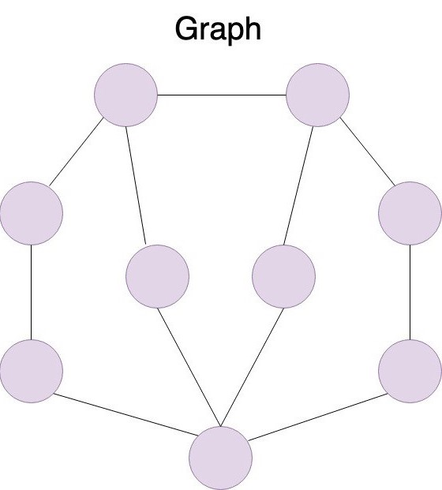
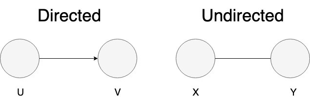
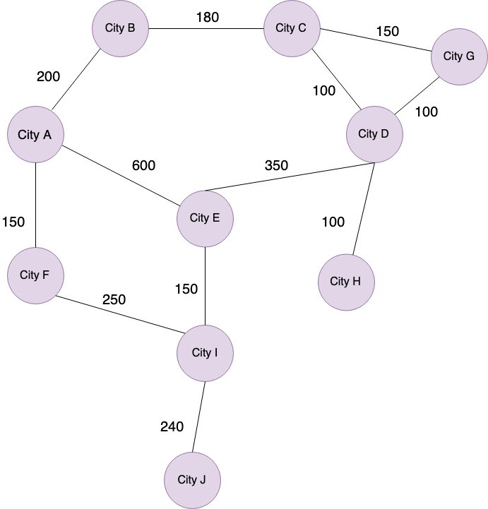
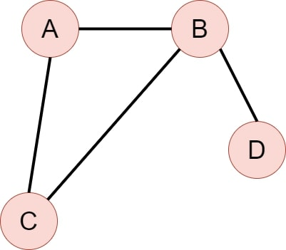

# Лабораторная работа №3
  
## Дано  

1. [Текст](./assets/article.txt) про определение уровня боли у мышей по выражению их морд, вы уже встречались с ним лабораторной работе №2  ([источник](https://nplus1.ru/news/2022/09/05/mouse-pain-face))
2. [Список](./assets/stop_words.txt) стоп-слов русского языка (предлоги, союзы, местоимения и другие неполнозначные слова русского языка). Список составлен на основе списка стоп-слов библиотеки для работы с естественным языком [NLTK](https://www.nltk.org/index.html).

Код, считывающий все перечисленные выше материалы, уже написан для вас в `start.py`. 
Вы найдете эти ресурсы в следующих переменных:
* `text` - текст статьи
* `stop_words` - список стоп слов

В настоящей лабораторной работе необходимо выделить ключевые слова.

**Важно:** В рамках данной лабораторной работы **нельзя использовать сторонние модули, модуль collections и модуль itertools.**

**Важно:** Вы *можете* использовать функции из предыдущих лабораторных работ.

## Терминология

В данной работе вам предлагается поработать с такой структурой организации данных как *граф*. Давайте коротко рассмотрим его характеристики.

Граф – сложная нелинейная структура данных, отображающая связи между разными объектами. 


<sub><sup>[источник картинки](https://medium.com/swlh/data-structures-graphs-50a8a032db03)</sub></sup>

На картинке выше изображен граф. Круги называются **вершинами** (vertex), соединяющие их линии - **ребрами** (egde). Как видите, может быть так, что не все вершины соединены между собой. Если у двух вершин есть общее соединяющее их ребро, то такие вершины называются **инцидентными**. Ребро, соединяющее вершину с самой собой, называется *петлей*. На данном графе нет петель.

Графы бывают **ориентированные** (directed) и **неориентированные** (undirected). В ориентированных графах ребра различаются по их направлению: есть вершина, из которой ребро исходит, и вершина, к которой оно направлено. В неориентированных графах такой различия нет.  


<sub><sup>[источник картинки](https://medium.com/swlh/data-structures-graphs-50a8a032db03)</sub></sup>

Графы также делятся на **взвешенные** и **невзвешенные**. Во взвешенных графах ребра могут иметь разный вес. Так, например, на картинке ниже изображен взвешенный граф. В этом графе ребра символизируют путь из одного города в другой, и эти пути различаются по своей сложности. 


<sub><sup>[источник картинки](https://medium.com/swlh/data-structures-graphs-50a8a032db03)</sub></sup>

В настоящей лабораторной графы будут использованы как *способ представить текст*. В таких графах вершинами являются слова, а ребрами - связи между словами. Более подробная информация представлена в шагах №4 и №7.

## Подход к выделению ключевых фраз

У большинства задач есть несколько решений. Это применимо и к выделению ключевых слов. 

В [лабораторной работе №1](../lab_1_keywords_tfidf/README.md) вы познакомились с выделением ключевых слов с помощью метрик TF-IDF и $\chi^2$. 
В [лабораторной работе №2](../lab_2_keywords_cooccurrence/README.md) был использован алгоритм RAKE.
В настоящей лабораторной работе вам предлагается реализовать алгоритм [TextRank](https://web.eecs.umich.edu/~mihalcea/papers/mihalcea.emnlp04.pdf). 

Данный алгоритм основан на алгоритме [PageRank](http://papers.cumincad.org/data/works/att/2873.content.pdf), который используется для расчета веса веб-страниц. Представляется, что информацию о важности веб-страниц можно извлечь из того, как эти веб-страницы ссылаются друг на друга. Именно поэтому представление в виде графа оказывается очень удобным здесь: если представить, что ссылку одной страницы на другую можно закодировать в виде ребра между двумя страницами, то при помощи нескольких итераций не очень хитрых вычислений можно определить оптимальные веса для каждой из вершин.
В TextRank, соответственно, вместо страниц вершинами являются слова, а вместо ссылок учитывается совместная встречаемость. Больше деталей о работе алгоритма вы найдете в шагах №5 и №8.

## Что надо сделать  
### Шаг 0. Подготовка (проделать вместе с преподавателем на практике).  
  
1. Изменить файлы `main.py` и `start.py`  
2. Закоммитить изменения и создать новый pull request

Обратите внимание, что для создания нового pull request создавать новый форк не нужно! Достаточно закрыть старый pull request, в котором вы работали над первой лабораторной, и открыть новый. 
При этом чтобы все изменения родительского репозитория (в том числе связанные с новой лабораторной) появились у Вас локально, нужно сделать `git pull`.
Инструкция, как открыть pull request, лежит [здесь](https://github.com/fipl-hse/2022-2-level-labs/blob/main/docs/public/starting_guide_ru.md#%D1%81%D0%BE%D0%B7%D0%B4%D0%B0%D0%BD%D0%B8%D0%B5-pull-request).
  
**Важно:** Код, выполняющий все действия от предобработки текста до выделения ключевых слов, должен быть написан в `start.py`. 
Для этого реализуйте функции в модуле `main.py` и импортируйте их в `start.py`.
  
```py  
if __name__ == '__main__':  
 # your code goes here
```
В рамках данной лабораторной работы **нельзя использовать сторонние модули и модуль collections.**  
  
  
### Шаг 1. Очистка и токенизация текста при помощи `TextPreprocessor`

В настоящей лабораторной за всю предобработку текста отвечает класс `TextPreprocessor`. Именно внутри него должен быть реализован весь пайплайн преобразования текста из монолитной неочищенной строки в корректные токены. Давайте рассмотрим, какие методы для этого необходимы.

#### Шаг 1.1 Конструктор класса

Для создания объекта `TextPreprocessor` нам необходимо знать, что именно нужно удалить из неочищенной строки. Именно поэтому в конструктор передаются следующие аргументы:

* `_stop_words` - кортеж из стоп-слов
* `_punctuation` - кортеж, содержащий в себе все подлежащие удалению символы

Внутри конструктора необходимо сохранить пришедшие на вход аргументы в одноименные атрибуты класса. Таким образом, у объекта класса `TextPreprocessor` должны быть следующие поля: `_stop_words`, `_punctuation`.


Интерфейс:   
```py  
class TextPreprocessor:
    def __init__(self, stop_words: tuple[str, ...], punctuation: tuple[str, ...]) -> None:
        pass
```  

#### Шаг 1.2 Очистка и токенизация текста

Этот метод препроцессора, как вытекает из названия, очищает текст от знаков препинания и делит его на отдельные токены. 

Метод принимает на вход неочищенный текст. Обратите внимание, что пунктуацию в этот метод передавать не нужно: информацию о том, какие знаки считать пунктуационными, этот метод берет из ранее сохраненной в поле экземпляра строки. 

Возвращаемым значением метода является кортеж выделенных токенов.

Интерфейс:   
```py  
_clean_and_tokenize(text: str) -> tuple[str, ...]:
    pass
```  

> Проверьте себя: почему название метода начинается с нижнего подчеркивания?

#### Шаг 1.3 Удаление стоп-слов

В этом методе происходит фильтрация токенов: стоп-слова необходимо убрать. Как и на предыдущем шаге, не нужно дополнительно сообщать методу, какие слова считаются стоп-словами, эта информация уже сохранена в самом экземпляре, нужно обращаться к нему. 

Входным аргументом метода является кортеж из токенов. Возвращает метод также кортеж из токенов, не содержащий стоп-слов.

Интерфейс:   
```py  
def _remove_stop_words(self, tokens: tuple[str, ...]) -> tuple[str, ...]:
    pass
```  

#### Шаг 1.4 Полная предобработка текста

Внутри данного метода должен быть реализован весь пайплайн предобработки текста. Функция принимает монолитную неочищенную строку и возвращает очищенные отфильтрованные токены. При реализации этого метода **необходимо** обращаться к уже определенным методам класса.

Интерфейс:   
```py  
def preprocess_text(self, text: str) -> tuple[str, ...]:
    pass
```  

### Шаг 2. Кодирование текста 

При работе с естественным языком часто прибегают к кодированию текста. Это связано в том числе с тем, что многие операции дешевле проводить над числами, нежели чем над последовательностью символов. Например, сравнение двух чисел происходит намного быстрее, чем сравнение двух строк.

В настоящей лабораторной мы также перейдем от строк к числам. Поможет нам в этом класс `TextEncoder`. Рассмотрим его методы.

#### Шаг 2.1 Конструктор класса

Чтобы экземпляр кодировщика мог успешно переводить токены в числа и обратно, необходимо завести внутри объекта два словаря. Один из них хранит соответствия вида `строка -> число` и называется `_word2id`, а другой хранит соответствия `число -> строка` и называется `_id2word`. Мы пока не знаем, с какими именно строками нам придется работать, поэтому нужно инициализировать эти два атрибута пустыми словарями. Позже они будут заполнены.

Конструктор ничего не принимает на вход.

Интерфейс:   
```py  
class TextEncoder:
    def __init__(self) -> None:
        pass
```  

#### Шаг 2.2 Заполнение атрибутов класса

Данный метод кодировщика принимает на вход кортеж из строк и соответствующим образом заполняет атрибуты `_word2id` и `_id2word`. Метод ничего не возвращает.
Каждой строке должно быть присвоено целое число. Одной строке присваивается ровно одно уникальное число. **Минимальное число среди присвоенных чисел должно быть не меньше 1000.**

Рассмотрим пример. Пусть дана следующая последовательность токенов: `('в', 'лесу', 'родилась', 'ёлочка', 'в', 'лесу', 'она', 'росла')`
В этой последовательности всего 6 разных строк: `'в'`, `'лесу'`, `'она'`, `'родилась'`, `'росла'`, `'ёлочка'`. Присвоим каждой из этих строк по одному уникальному числу больше 1000. Допустим, соответствие получается такое:

* `'в'` - `1009`
* `'лесу'` - `1001`
* `'она'` - `1005`
* `'родилась'` - `1101`
* `'росла'` - `1061`
* `'ёлочка'` - `1041`

Тогда атрибут `_word2id` должен выглядеть следующим образом: `{'в': 1009, 'лесу': 1001, 'она': 1005, 'родилась': 1101, 'росла': 1061, 'ёлочка': 1041}`. 
В `_id2word`, соответственно, ключи и значения меняются местами: `{1009: 'в', 1001: 'лесу', 1005: 'она', 1101: 'родилась', 1061: 'росла', 1041: 'ёлочка'}`.

Если вы все сделали правильно, то длина данных атрибутов должна совпадать.

Интерфейс:   
```py  
def _learn_indices(self, tokens: tuple[str, ...]) -> None:
    pass
```  
   
#### Шаг 2.3 Преобразование последовательности строк в последовательность чисел
   
Этот метод принимает на вход кортеж из строк и возвращает кортеж из чисел.
Внутри функции вызывается метод `_learn_indices`, который задает соответствие между строками и числами.
Выбор числа, на которое необходимо заменить каждую из строк, определяется атрибутом `_word2id`.

Например, на вход пришла такая последовательность: `'она', 'родилась', 'в', 'лесу'`. Обращаясь к атрибутам, сформированным на предыдущем шаге, мы должны получить следующую закодированную последовательность: `1005, 1101, 1009, 1001`.

В случае, если на вход приходит пустая последовательность токенов,  возвращает `None`. 

Интерфейс:   
```py  
def encode(self, tokens: tuple[str, ...]) -> Optional[tuple[int, ...]]:
    pass
```  

#### Шаг 2.4 Декодирование токенов

Превращение слов в числа упрощает работу с ними, но никак не их читаемость. Мы стремимся выделить из текста ключевые слова, а не числа, поэтому нужно реализовать обратное преобразование. Метод принимает на вход кортеж из чисел и возвращает кортеж из строк. Информацию о соответствии между числами и строками необходимо брать из атрибутов объекта.

Например, на вход пришла такая последовательность: `1061, 1009, 1001, 1041`. Обращаясь к атрибутам, сформированным на предыдущем шаге, мы должны получить следующую закодированную последовательность: `'росла', 'в', 'лесу', 'ёлочка'`.

В случае, если на вход приходит последовательность, в которой есть слова, не содержащиеся в атрибутах экземпляра класса, возвращается `None`.

Интерфейс:   
```py  
def decode(self, encoded_tokens: tuple[int, ...]) -> Optional[tuple[str, ...]]:
    pass
```  

### Шаг 3. Выделение пар слов. Выполнение Шагов 1-3 соответствует 4 баллам

Используемый в этой лабораторной работе алгоритм опирается на совместную встречаемость слов. В этом шаге необходимо научиться ее извлекать. 

Функция принимает на вход список закодированных токенов и ширину окна. Возвращаемым значением является кортеж пар токенов, которые встречаются рядом. Мы считаем, что слова встречаются рядом, если они помещаются в одно *окно*. Окно - это отрезок списка токенов определенной длины. Давайте рассмотрим пример. 

* последовательность токенов: `(1, 2, 3, 4, 3)`
* длина окна: `3`
* выделенные пары слов: `((1, 2), (1, 3), (2, 3), (3, 4), (2, 4))`

Обратите внимание, что пара `(3, 3)` не была выделена: нас интересуют *разные* токены, умещающиеся в одно окно.

Если на вход приходит пустая последовательность токенов, нецелочисленное значение длины окна или длина окна меньше 2, то возвращается `None`. 

Интерфейс:   
```py
def extract_pairs(tokens: tuple[int, ...], window_length: int) -> Optional[tuple[tuple[int, ...], ...]]:
    pass
```  

Продемонстрируйте работу данной функции в файле `start.py`, передав ей закодированный токенизированный текст. 

### Шаг 4. Представление текста в виде графа. Матрица смежности

Мы хотим задать такой граф, в котором вершинами будут являться токены, а ребрами - связи между токенами. Мы строим *невзвешенный* граф: мы не дифференцируем связи между словами по их силе/близости/др. Если токены встречаются на расстоянии не больше длины окна, то между ними есть ребро, то есть эти вершины *инцидентны*. Если слова никогда не образовывали такую пару, то они не инцидентны. 

Кроме этого, предлагается также не учитывать порядок слов и сделать граф *неориентированным*: главное, что слова встретились вместе в каком-то окне, а порядок, в котором они там появились, нас не интересует

> В оригинальной статье по алгоритму PageRank вы увидите, что авторы используют ориентированный граф. В более поздних работах, описывающих применение этого алгоритма для взвешивания слов в тексте, было отмечено, что алгоритм можно также применять и к неориентированным графам, в этом случае процесс обучения может идти более плавно, но он неизбежно приведет к тем же результатам.  ([ссылка](https://web.eecs.umich.edu/~mihalcea/papers/mihalcea.emnlp04.pdf))

Существует несколько способов задать граф. Один из распространенных - матрица смежности. Давайте познакомимся с этим форматом хранения графа. 

Допустим, у нас вот такой неориентированный невзвешенный граф:



Матрица смежности представляет собой не что иное, как таблицу. В нашем случае незаполненная матрица смежности выглядит вот так.

|   |A   |B   |C   |D   |
|---|---|---|---|---|
|A   |   |   |   |   |
|B   |   |   |   |   |
|C   |   |   |   |   |
|D   |   |   |   |   |

В ней одинаковое количество столбцов и строк. При этом каждая строка и каждый столбец соответствуют одной какой-либо вершине графа. Например, на пересечении строки, соответствующей вершине А, и столбца, соответствующего вершине В, будет записано число, отражающее наличие или отсутствие ребра между этими вершинами. Давайте посмотрим, как она выглядит в заполненном виде.

|   |A  |B  |C  |D  |
|---|---|---|---|---|
|A   |0   |1  |1   |0  |
|B   |1   |0  |0   |1  |
|C   |1   |0  |0   |0  |
|D   |0   |1  |0   |1  |

> Проверьте себя: почему у нас получилась симметричная матрица? Может ли матрица смежности быть несимметричной? Каким тогда должен быть граф?

Ниже описаны шаги реализации матрицы смежности.

#### Шаг 4.1 Конструктор

Инициализация матрицы смежности не требует никаких входных аргументов. Конструктор задает необходимые атрибуты класса.

У каждого объекта графа **обязательно** должны быть следующие атрибуты:
* `self._matrix` - таблица, кодирующая связи между вершинами. Ожидаемый тип данных, хранящийся в этом атрибуте: `list[list[int]]]`. Пока в граф не добавлено ни одной вершины, можно задать это поле пустым списком.

```py
class AdjacencyMatrixGraph:
    def __init__(self) -> None:
        pass
```

#### Шаг 4.2 Добавление ребра

В данной лабораторной граф является изменяемой структурой данных: мы можем добавлять вершины и ребра после инициализации объекта.

Ответственным за это является метод `add_edge`. Он принимает на вход две вершины. Внутри функции записывается наличие ребра между этими вершинами в поле `_matrix`. В случае, если вершины, пришедшей в качестве аргумента, в графе еще нет, необходимо ее добавить. 

Петли, то есть ребра, соединяющие вершину с самой собой, добавлять нельзя. 

Если добавление ребра прошло успешно, то метод возвращает 0. Если в качестве обоих входных аргументов выступила одна и та же вершина, то возвращается -1.

Интерфейс:
```py
add_edge(self, vertex1: int, vertex2: int) -> int:
    pass
```

#### Шаг 4.3 Получение веса ребра

Для использования графа необходимо иметь возможность запросить у него информацию о том, связаны ли две вершины ребром. Для этого нужно определить метод `is_incidental`. Метод принимает на вход два аргумента: вершина №1 и вершина №2. Метод возвращает 1, если эти вершины инцидентны, в противном случае возвращается 0.

Если какая-либо из запрошенных вершин отсутствует в графе, возвращается -1.

Интерфейс:
```py
def is_incidental(self, vertex1: int, vertex2: int) -> int:
    pass 
```

#### Шаг 4.4 Получение информации обо всех вершинах

Также необходимо реализовать возможность узнать, какие вершины есть в графе. Для этого следует реализовать метод `get_vertices`. Он не принимает никаких аргументов. Возвращаемым значением является кортеж вершин сохраненного графа.

Интерфейс:
```py
def get_vertices(self) -> tuple[int, ...]:
    pass
```

#### Шаг 4.5 Подсчет количества инцидентных вершин

Для работы алгоритма TextRank очень важно знать, с каким количеством вершин каждая конкретная вершина имеет общие ребра. Это называется `InOut score`. 

> В оригинальной статье Вы можете увидеть, что вместо `InOut score` различаются `In score` и `Out score`. Такое разделение обусловлено ориентированностью графа. В данной лабораторной мы реализуем неориентированный граф, поэтому для нас имеет смысл только количество инцидентных вершин.

Функция принимает на вход вершину и возвращает количество инцидентных с ней вершин. Если на вход приходит вершина, которой нет в графе, возвращается -1.

Интерфейс:
```py
def calculate_inout_score(self, vertex: int) -> int:
    pass
```

#### Шаг 4.6. Заполнение экземпляра графа 

Для упрощения работы с экземпляром графа реализуем метод, который заполнит его всеми вершинами и ребрами, которые можно извлечь из последовательности закодированных токенов.

Метод принимает на вход последовательность токенов и длину окна. Внутри функции происходит выделение пар слов и добавление соответствующих ребер в граф. Необходимо обращаться к функции `extract_pairs` и к методу `add_edge`. Метод ничего не возвращает.

Интерфейс:
```py
def fill_from_tokens(self, tokens: tuple[int, ...], window_length: int) -> None:
    pass
```

### Шаг 5. Алгоритм TextRank. Классическая реализация

В алгоритме TextRank мы пытаемся оценить важность токенов путем анализа их совстречаемости. При этом оценка важности происходит итеративно. 

1. Изначально все веса инициализируются единицей. Можно выбрать любое число, но традиционно это `1`. 
2. После этого вес каждой вершины пересчитывается по этой формуле:
$$S(V_{i}^{k}) = (1 - d) + d \cdot \sum_{j \in InOut(V_{i})} \frac{1}{|InOut(V_{j})| } S(V_{j}^{k-1})$$

    Обозначения:
    * $V$ - вершина графа (то есть слово)
    * $d$ - damping factor, то есть вероятность перейти от этой вершины к любой другой, его значение обычно равно 0.85
    * $InOut(V)$ - вершины, инцидентные вершине $V$
    * $|InOut(V)|$ - количество вершин, инцидентных с $V$ (то есть, как мы назвали это в предыдущем пункте, `InOut score`)
    * $k$ - это номер итерации: при переподсчете веса вершины мы опираемся на веса инцидентных с ней вершин с *прошлых итераций*
    
    Таким образом, чтобы посчитать новый вес для новой вершины, нужно:
    * перебрать все вершины, инцидентные с данной вершиной
    * для каждой из таких вершин найти ее `InOut score`, использовать его как знаменатель в дроби $\frac{1}{|InOut(V_{j})|}$ и умножить полученное значение на вес этой же вершины
    * полученные значения просуммировать и умножить на $d$
    * далее результат умножения сложить с $(1 - d)$, и результат такого сложения становится новым весом рассматриваемой вершины

3. После такой оценки важности необходимо узнать, насколько сильно веса вершин изменились: для этого из веса каждой вершины вычитается ее предыдущий вес. Полученные разности суммируются и сравниваются с *порогом сходимости* - это какое-то маленькое заранее заданное число. В нашем случае оно равно 0.0001. Если сумма разностей весов оказалась меньше, чем это маленькое число, то можно сказать, что вес вершин почти не изменился. Это значит, что оптимальные веса были найдены, алгоритм завершается. В противном случае мы продолжаем переоценку важности вершин, возвращаясь в пункт 2.

#### Шаг 5.1 Конструктор класса и обучение

При инициализации класса на вход приходит один аргумент: заполненный объект графа. Внутри конструктора задаются необходимые для работы атрибуты. Рассмотрим их внимательнее:
* `_graph` - здесь хранится пришедший на вход заполненный граф, который, как мы помним, является репрезентацией текста
* `_damping_factor` - как упоминалось ранее, это константное значение, нужное для того, чтобы алгоритм не зациклился и отражающее вероятность перейти от конкретной вершины к любой другой; установите значение данного атрибута как 0.85
* `_convergence_threshold` - это константное значение, отражающее максимально допустимую разницу между весами до и после обновления: если после очередной итерации пересчета весов вершин сумма разностей вершин не превышает этот порог, то мы считаем, что оптимальные веса найдены; установите значение данного атрибута как 0.0001
* `_max_iter` - это константное значение, отражающее максимально допустимое количество итераций обновления весов: теоретически на вход может прийти очень сложный граф, в котором невозможно подобрать стабильные веса, и чтобы не попасть в бесконечный цикл, мы ограничиваем максимальное количество итераций; установите значение данного атрибута как 50
* `_scores` - веса вершин, здесь ключами являются вершины, а значениями их вес, отражающий их важность; инициализируйте этот атрибут пустым словарем

Интерфейс:
```py
def __init__(self, graph: Union[AdjacencyMatrixGraph, EdgeListGraph]) -> None:
    pass
```

#### Шаг 5.2 Обновление веса конкретной вершины

Реализуйте обновление веса конкретной вершины. Метод принимает на вход вершину, вес которой необходимо пересчитать, список инцидентных с ней вершин и словарь с весами вершин после предыдущей итерации обновления. 

Новый вес вершины необходимо рассчитать по формуле из Шага №5. Для получения информации о значении $d$ необходимо обратиться к соответствующему атрибуту класса, информацию о количестве инцидентных вершин нужно взять при помощи метода графа `calculate_inout_score`. Доступ к графу также происходит через атрибуты класса.

Метод ничего не возвращает. Вместо этого он перезаписывает вес вершины в словаре, хранящемся в атрибуте `scores`. 

Интерфейс: 
```py
def update_vertex_score(self, vertex: int, incidental_vertices: list[int], scores: dict[int, float]) -> None:
    pass
```

#### Шаг 5.3 Итеративное обновление весов вершин

Метод итеративного переподсчета важности токенов написан для вас: `train`. Метод ничего не принимает на вход и ничего не возвращает. Вместо этого он изменяет атрибут `_scores`.

Внимательно изучите код и приготовьтесь объяснить его на защите.

#### Шаг 5.4 Получение информации о весе вершин

Обращаться к защищенному атрибуту экземпляра извне - плохая практика. Поэтому необходимо реализовать метод, возвращающий словарь с весами вершин. 

Метод ничего не принимает на вход. Метод возвращает словарь, ключами в котором являются вершины, а значениями - их вес.

Интерфейс:
```py
def get_scores(self) -> dict[int, float]:
    pass
```

#### Шаг 5.5 Получение ключевых слов

Наконец, пора определять метод, возвращающий ключевые слова. 

Метод принимает на вход аргумент, обозначающий требуемое количество ключевых слов. Метод возвращает последовательность слов с самым высоким весом. 

В случае, если несколько вершин имеют один и тот же вес, порядок сортировки следующий: вершины с меньшим значением идут впереди вершин с большим значением. Рассмотрим пример. 

* Вершины и их веса: `{1: 0.2, 2: 0.3, 3: 0.3, 4: 0.2}`
* Правильный порядок сортировки: `2, 3, 1, 4`
У вершин `2` и `3` совпадает вес, но `2 < 3`, поэтому в возвращаемой последовательности `2` предшествует `3`. 
У вершин `1` и `4` совпадает вес, но `1 < 4`, поэтому в возвращаемой последовательности `1` предшествует `4`. 


```py
def get_top_keywords(self, n_keywords: int) -> tuple[int, ...]:
    pass
```

### Шаг 6. Демонстрация выделения ключевых слов. Выполнение Шагов 1-6 соответствует 6 баллам

Продемонстрируйте выделение ключевых слов в файле `start.py`. Не забудьте предобработать текст, закодировать его, создать экземпляр графа, заполнить его, итеративно вычислить вес его вершин, отобрать 10 самых важных токенов и декодировать их. При выделении пар рекомендуется использовать длину окна не превышающую 10. 

### Шаг 7. Представление текста в виде графа. Список ребер

Матрица смежности не единственный способ реализовать граф. В этом шаге мы познакомимся с таким представлением как список ребер. Обычно под этим понимается буквально список ребер. В настоящей лабораторной это больше похоже на список инцидентных вершин. Давайте разберемся, что имеется в виду. 

Вспомним наш граф.


Предлагается хранить информацию о ребрах графа при помощи словаря, в котором ключами являются вершины, а значениями - список инцидентных вершин. Таким образом, для нашего графа это будет выглядеть следующим образом: 

```py
{
    A: [C, B],
    B: [A, C, D],
    C: [A, B],
    D: [B]
}
```

Поэтапно рассмотрим реализацию. 

#### Шаг 7.1 Конструктор класса 

Инициализация графа не требует никаких входных аргументов. Конструктор задает необходимые атрибуты класса.

У каждого объекта графа обязательно должен быть атрибут `_edges`. В нем хранится словарь, кодирующий инцидентность вершин. Ожидаемый тип данных, хранящийся в этом атрибуте, выглядит следующим образом: `dict[int, list[int]]`. Пока в граф не добавлено ни одной вершины, можно задать это поле пустым словарем.

Интерфейс:
```py
class EdgeListGraph:
    def __init__(self) -> None:
        pass
```

#### Шаг 7.2 Унификация интерфейса

Экземпляр `EdgeListGraph` должен иметь такой же интерфейс, как и `AdjacencyMatrixGraph`. Реализуйте в классе `EdgeListGraph` следующие методы:
* `add_edge`
* `is_incidental`
* `get_vertices`
* `calculate_inout_score`
* `fill_from_tokens`

Интерфейс методов и возвращаемое значение в каждом из случаев остаются такими же, как описано для `AdjacencyMatrixGraph`.

#### Шаг 7.3 Демонстрация выделения ключевых слов на базе `EdgeListGraph`

Интерфейс классов `AdjacencyMatrixGraph` и `EdgeListGraph` совпадает неслучайно: представляется, что алгоритм выделения слов не должен зависеть от того, как именно организуется информация внутри графа. 

Выделите 10 ключевых слов при помощи алгоритма `VanillaTextRank`, передав ему заполненный объект `EdgeListGraph` в `start.py`.

### Шаг 8. Расширение классов `AdjacencyMatrixGraph` и `EdgeListGraph`. Учет позиции токенов в тексте

Попробуем улучшить алгоритм TextRank путем принятия во внимании позиций слов в тексте. Для этого необходимо добавить соответствующий функционал в абстракции графов. 

#### Шаг 8.1 Добавление атрибутов в конструкторы `AdjacencyMatrixGraph` и `EdgeListGraph`

Добавьте в конструкторы классов следующие атрибуты:
* `_positions`: данный атрибут должен хранить в себе информацию обо всех позициях каждой из вершин графа, предполагаемый тип: `dict[int, list[int]]`, инициализируйте как пустой словарь
* `_position_weights`: данный атрибут должен хранить в себе информацию обо всех позиционных *весах* каждой из вершин графа, предполагаемый тип: `dict[int, float]`, инициализируйте как пустой словарь

#### Шаг 8.2 Сохранение информации о позициях токенов

В классах `AdjacencyMatrixGraph` и `EdgeListGraph` реализуйте метод, принимающий на вход последовательность закодированных токенов и заполняющий атрибут `_positions`. Значением словаря `_positions` должен быть словарь всех позиций токена в последовательности токенов. Рассмотрим пример. 

Допустим, последовательность токенов выглядит так: `(1, 256, 4, 95, 1, 420, 5)`
Токен `1` встречается на первой позиции и на пятой. Поэтому значение `positions` по ключу `1` должно быть равно `[1, 5]`.

> Обратите внимание, что в данном контексте понятие *позиция* отличается от понятия *индекс*: индексация начинается с нуля, а нумерация позиций - с единицы.

Интерфейс:
```py
def fill_positions(self, tokens: tuple[int, ...]) -> None:
    pass
```

#### Шаг 8.3 Подсчет веса вершины исходя из позиции слова в тексте

Позиционный вес вершины рассчитывается по следующей формуле:

$$p(V) = \frac{1}{position_{1}} + \frac{1}{position_{2}} + \frac{1}{position_{3}} + ...$$

$position_{i}$ обозначает индекс i-ого вхождения слова, при этом нумерация начинается с 1. Давайте посмотрим на пример. 

Пусть дана такая последовательность токенов: `(1, 2, 3, 4, 1, 7, 10)`.
Рассчитаем позиционный вес токена `1`. Токен `1` встретился два раза: первый раз в позиции 1, второй раз - в позиции 5. Поэтому его позиционный вес вычисляется так: $p(1) = \frac{1}{1} + \frac{1}{5}$. Несложно посчитать, что $p(1) = 1.2$. 

Если токен встречается в тексте 100 раз, то в формуле его позиционного веса будет 100 слагаемых, если один раз, то одно. Кажется, довольно просто.

Однако если мы оставим веса в таком виде, то они по своему масштабу "перекричат" значение $d$: оно, как мы помним, традиционно равно 0.85. Поэтому веса необходимо нормировать:

$$\tilde{p_{i}} = \frac{p_{i}}{p_{1} + p_{2} + ... + p_{|V|}}$$

Здесь $\tilde{p_{i}}$ - это нормированный позиционный вес токена $i$,   $p_{i}$ - ненормированный позиционный вес токена $i$ (то есть обычный, который мы посчитали выше), а $p_{1} + p_{2} + ... + p_{|V|}$ - это сумма ненормированных весов всех вершин. Таким образом, нормированные веса не превышают 1. 

В методе `calculate_position_weights` необходимо реализовать подсчет нормированных позиционных весов для каждого из вершин графа. Метод ничего не принимает на вход: информация о вершинах графа и об их позициях в тексте извлекается через обращение к атрибутам. Метод ничего не возвращает, но изменяет словарь, лежащий в атрибуте `_position_weights`, в котором ключами являются вершины графа, а значениями - их нормированные позиционные веса. 

Интерфейс:
```py
def calculate_position_weights(self) -> None:
    pass
```

#### Шаг 8.4 Получение информации о позиционных весах

Необходимо реализовать публичный метод, возвращающий информацию о позиционных весах токенов. Метод не принимает дополнительные аргументы. Метод возвращает словарь, в котором ключами являются вершины, а значениями - их нормированные позиционные веса.

Интерфейс:
```py
def get_position_weights(self) -> dict[int, float]:
    pass
```


### Шаг 9. Алгоритм `PositionBiasedTextRank`. Учет позиции слов в тексте. Выполнение шагов 1-9 соответствует 8 баллам

У алгоритма TextRank есть множество улучшенный версий. Одной из них является модификация `PositionBiasedTextRank`. Как это понятно из названия, в данной версии в расчет весов вершин (слов) принимается позиция этого слова в тексте.

Представляется, что чем ближе к началу встречается слово и чем чаще оно встречается, тем более важным оно является. Поэтому в данной модификации формула обновления веса вершины выглядит так: 

$$S(V_{i}) = (1 - d) \cdot \tilde{p}  + d \cdot \sum_{j \in InOut(V_{i})} \frac{1}{|InOut(V_{j})| } S(V_{j})$$

Формула практически не отличается от той, которую мы использовали в шаге 5: единственным отличием является дополнительный множитель в первом слагаемом: это позиционный вес слова. Чем ближе слово к началу и чем чаще слово встречается в тексте, тем позиционный вес больше. Далее мы рассмотрим вычисление позиционных весов более подробно.

#### Шаг 9.1 Конструктор класса `PositionBiasedTextRank`

Для того чтобы иметь возможность принимать во внимание позицию слова в тексте, нам необходимо задать соответствующие атрибуты. 

Конструктор принимает на вход заполненный объект графа.

Данный класс наследуется от `VanillaTextRank`. Именно поэтому определение части атрибутов необходимо делегировать родительскому классу, обратившись к `super()`.

Кроме атрибутов, которые задаются в конструкторе родительского класса, необходимо задать поле `_position_weights` - это словарь, в котором ключами являются вершины, а значениями - их позиционный вес. Для инициализации этого атрибута обратитесь к соответствующему *методу* пришедшего на вход экземпляра графа. 

Интерфейс:
```py
class PositionBiasedTextRank(VanillaTextRank):
    def __init__(self, graph: Union[AdjacencyMatrixGraph, EdgeListGraph]) -> None:
        pass
```

#### Шаг 9.2 Обновление веса вершины

Так как в данной модификации подсчет веса вершины происходит по немного другой формуле, нежели чем в классической вариации TextRank, необходимо переопределить метод обновления веса вершины. 

Метод все также принимает на вход вершину, вес которой необходимо пересчитать, список инцидентных с ней вершин и словарь с весами вершин после предыдущей итерации обновления.

Новый вес вершины необходимо рассчитать по формуле из пункта 9. Для получения информации о значении $d$ необходимо обратиться к соответствующему атрибуту класса, информацию о количестве инцидентных вершин нужно взять при помощи метода графа `calculate_inout_score`. Доступ к графу также происходит через атрибуты класса. Наконец, информацию о позиционных весах также нужно получать через соответствующий атрибут объекта. 

Метод ничего не возвращает. Вместо этого он перезаписывает вес вершины в словаре, хранящемся в атрибуте `scores`.

Интерфейс:
```py
def update_vertex_score(self, vertex: int, incidental_vertices: list[int], scores: dict[int, float]) -> None:
    pass
```

#### Шаг 9.3 Продемонстрируйте выделение ключевых слов `PositionTextRank`

Покажите 10 самых значимых ключевых слов, выделенных при помощи класса `PositionTextRank`, в `start.py`. Для этого используйте функцию `get_top_n`.

Проделайте это 2 раза, передав при инициализации алгоритму сначала заполненный экземпляр `AdjacencyMatrixGraph`, а затем `EdgeListGraph`.

> С каким вариантом графа поиск проходит быстрее? Почему?

> Отличается ли выбор ключевых слов у разных модификаций TextRank? 

### Шаг 10. Унификация интерфейса для алгоритма выделения ключевых слов на основе TF-IDF

К текущему моменту мы научились выделять ключевые слова 4 разными способами: при помощи подсчета TF-IDF, при помощи алгоритма RAKE, а также при помощи двух вариаций алгоритма TextRank. Но какой из этих способов дает наилучший результат? Именно это мы и попытаемся установить. 

Для этого в репозиторий наряду с остальными материалами загружена папка [`benchmark materials`]((./assets/benchmark_materials) ). В ней содержатся все необходимые для сравнения материалы: 
* 9 новостных транскриптов англоязычных новостных сообщений и 9 соответствующих им наборов ключевых слов.  Материалы взяты из датасета [500N-KeyPhrasesCrowdAnnotated-Corpus](https://arxiv.org/abs/1306.4886). Новостные транскрипты различаются по темам. Соответствие индексов файлов и тем:
    *  `0` - `culture`
    *  `1` - `business`
    *  `2` - `crime`
    *  `3` - `fashion`
    *  `4` - `health`
    *  `5` - `politics`
    *  `6` - `science`
    *  `7` - `sports`
    *  `8` - `tech`
* [`eng_stop_words.txt`](./assets/benchmark_materials/eng_stop_words.txt) - список стоп-слов для английского языка 
* [`IDF.json`](./assets/benchmark_materials/IDF.json) - словарь с IDF значениями для слов, которые могут встретиться в новостных транскриптах. 

Вам необходимо считать эти материалы самостоятельно.

Кроме этого, для того, чтобы было удобно сравнивать работу разных алгоритмов, необходимо, чтобы у них был одинаковый интерфейс. Если с `VanillaTextRank` и `PositionBiasedTextRank` проблемы разных интерфейсов нет, то реализации RAKE и TF-IDF алгоритма сильно отличаются. В текущем шаге предлагается реализовать *обертку* над алгоритмом TF-IDF. Иными словами, необходимо написать класс, в котором поочередно вызываются методы из реализации соответствующей лабораторной работы. Требуется, чтобы название и функции этих методов совпадали с методами TextRank. 

#### Шаг 10.1 Конструктор класса 

Конструктор класса-обертки `TFIDFAdapter` принимает на вход два аргумента: список токенов и словарь с IDF весами. Необходимо сохранить значения этих аргументов в атрибуты `_tokens` и `_idf` соответственно. Также необходимо завести атрибут `_scores`, в котором будут храниться значения TF-IDF для каждого из токенов. Предполагаемый тип данного атрибута - `dict[str, float]`. Пока в него не добавлено ни одного значения, можно инициализировать его как пустой словарь. 

Интерфейс:
```py
class TFIDFAdapter:
    def __init__(self, tokens: tuple[str, ...], idf: dict[str, float]) -> None:
        pass
````

#### Шаг 10.2 Вычисление значений TF-IDF

Реализуйте метод, подсчитывающий значение TF-IDF для каждого из переданных в конструктор токенов. Внутри этого метода необходимо в правильном порядке вызвать функции из лабораторной `lab_1_keywords_tfidf`: 
* `calculate_frequencies`
* `calculate_tf`
* `calculate_tfidf`, значения IDF необходимо брать из соответствующего атрибута экземпляра

Получившиеся значения TF-IDF необходимо сохранить в атрибут `_scores`. 

В случае, если подсчет значений не представляется возможным (например, какая-либо функция возвращает `None`), метод возвращает `-1`. Если же подсчет значений TF-IDF прошел успешно, метод возвращает `0`.

Интерфейс:
```py
def train(self) -> int:
    pass
````

#### Шаг 10.3 Отбор ключевых слов

Реализуйте метод, возвращающий определенное количество самых важных токенов с точки зрения TF-IDF. Метод принимает один аргумент, обозначающий требуемое количество ключевых слов. Метод возвращает кортеж из наиболее важных токенов.

Интерфейс:
```py
def get_top_keywords(self, n_keywords: int) -> tuple[str, ...]:
    pass
````

### Шаг 11. Унификация интерфейса для алгоритма выделения ключевых RAKE

Теперь, когда мы унифицировали интерфейс для алгоритма на основе TF-IDF, остается проделать то же самое для алгоритма RAKE. Для этого необходимо обращаться к функциям, заданным в реализации лабораторной работы `lab_2_keywords_cooccurrence`. 

Однако, как вы помните, алгоритм RAKE специализируется на выделении ключевых *фраз*, а не отдельных слов. Это несколько отличается от подхода через TF-IDF или TextRank, поэтому в обертке над RAKE мы не только унифицируем интерфейс, но и немного урежем функциональность, то есть оставим за рамками подсчет кумулятивного веса фраз, а также их объединение. Ключевые слова предлагается подбирать на основе `word scores`. 

#### Шаг 11.1 Конструктор класса 

Конструктор класса-обертки над алгоритмом RAKE принимает на вход два аргумента: текст, из которого необходимо выделить ключевые слова, и последовательность стоп-слов. Необходимо сохранить значения этих аргументов в атрибуты `_text` и `_stop_words` соответственно. Кроме этого, необходимо определить атрибут `_scores`, в который будут сохраняться `word scores`, выделенные алгоритмом. Предполагаемый тип - `dict[str, float]`. Пока туда не добавлено ни одного значения, инициализируйте этот атрибут пустым словарем. 

Интерфейс:
```py
class RAKEAdapter:
    def __init__(self, text: str, stop_words: tuple[str, ...]) -> None:
        pass
```

#### Шаг 11.2 Подсчет `word scores`

Реализуйте метод, подсчитывающий значение `word score` для каждого из токенов. Внутри этого метода необходимо в правильном порядке вызвать функции из лабораторной `lab_2_keywords_cooccurrence`: 
* `extract_phrases`
* `extract_candidate_keyword_phrases`
* `calculate_frequencies_for_content_words`
* `calculate_word_degrees`
* `calculate_word_scores`

Получившиеся значения `word_scores` необходимо сохранить в атрибут `_scores`.

В случае, если подсчет значений не представляется возможным (например, какая-либо функция возвращает `None`), метод возвращает `-1`. Если же подсчет значений прошел успешно, метод возвращает `0`.

Интерфейс:
```py
def train(self) -> int:
    pass
```

#### Шаг 11.3 Отбор ключевых слов

Реализуйте метод, возвращающий определенное количество самых важных токенов с точки зрения `word scores`. Метод принимает один аргумент, 
обозначающий требуемое количество ключевых слов. Метод возвращает кортеж из наиболее важных токенов.

В случае, если несколько токенов имеют один и тот же вес, порядок сортировки лексикографический, при этом цифры должны идти раньше букв. 

* Вершины и их веса: `{'1': 0.2, 'кот': 0.2, 'колбаса': 0.2, '15': 0.3, '7': 0.3, 'дерево': 0.3}`
* Правильный порядок сортировки: `'1', 'колбаса', 'кот', '15', '7', 'дерево'`
У вершин `колбаса` и `кот` совпадает вес, но по алфавиту `л < т`, поэтому в возвращаемой последовательности `колбаса` предшествует `кот`. 
У вершин `1` и `колбаса` совпадает вес, но мы условились, что цифры идут раньше букв, поэтому в возвращаемой последовательности `1` предшествует `колбаса`. 
У вершин `15` и `7` совпадает вес, но в лексикографическом порядке `1 < 7`, поэтому в возвращаемой последовательности `15` предшествует `7`. 


Интерфейс:
```py
def get_top_keywords(self, n_keywords: int) -> tuple[str, ...]:
    pass
````

### Шаг 12. Сравнение всех алгоритмов выделения ключевых слов. Выполнение шагов 1-12 соответствует 10 баллам

Теперь, когда у нас есть четыре класса, решающие одну и ту же задачу и имеющие один и тот же интерфейс, мы можем приступить непосредственно к их сравнению. Для этого научимся считать метрику Recall и реализуем класс `KeywordExtractionBenchmark`.

#### Шаг 12.1 Подсчет метрики `Recall`

Recall (полнота) показывает, какую долю из общих объектов класса составляют найденные объекты. 

$$Recall = \frac{TP}{TP + FN}$$
Обозначения:
* $TP$ - True Positive, то есть те слова, которые были распознаны алгоритмом как ключевые и которые *действительно* являются ключевыми
* $FN$ - False Negative, то есть те слова, которые **не** были распознаны алгоритмом как ключевые, но которые в действительности ими (ключевыми) являются

Рассмотрим пример. 
* Правильные ключевые слова: `'milan', 'dolce', 'gabbana', 'design', 'judge', 'inquiry', 'madonna', 'evidence', 'couple'`
* Предсказанные ключевые слова: `'italian', 'dolce', 'gabbana', 'trial', 'evidence', 'fashion', 'duo', 'milan', 'design', 'company', 'milanese'`

Предсказанные ключевые слова содержат следующие настоящие ключевые слова: `'milan', 'dolce', 'gabbana', 'design', 'evidence'`. Их пять, поэтому значение $True Positive$ равно `5`. 

Следующие настоящие ключевые слова не были обнаружены алгоритмом: `'judge', 'inquiry', 'madonna', 'couple'`, их четыре, поэтому значение $False Negative$ равно `4`. 

Тогда $Recall$, согласно формуле, равен $\frac{TP}{TP + FN} = \frac{5}{5 + 4} = 0.(5)$

Реализуйте функцию, вычисляющую значение полноты. Функция принимает предсказанные ключевые слова и правильные ключевые слова. Функция возвращает значение полноты.

Интерфейс:
```py
def calculate_recall(predicted: tuple[str, ...], target: tuple[str, ...]) -> float:
    pass
```


#### Шаг 12.2 Конструктор класса

Конструктор класса принимает 4 аргумента: последовательность стоп-слов, последовательность пунктуационных знаков, словарь со значениями IDF и путь к материалу, на котором будет проводиться сравнение. Значения данных аргументов необходимо сохранить в следующие атрибуты: `_stop_words`, `_punctuation`, `_idf`, `_materials_path`.

Кроме этого, необходимо сохранить следующие атрибуты: 
* `themes` - кортеж из тем новостных транскриптов, присвойте этому атрибуту значение `('culture', 'business', 'crime', 'fashion', 'health', 'politics', 'science', 'sports', 'tech')`
* `report` - словарь, хранящий в себе информацию о том, насколько хорошо каждый из алгоритмов выделяет ключевые слова по каждой из тем

Обратите внимание, что порядок тем в `themes` совпадает с порядком текстов в `benchmark_materials`: так, текст и ключевые слова с индексом 0 относятся к теме `culture`, а текст и ключевые слова с индексом 8 относятся к теме `tech`.

Интерфейс:
```py
class KeywordExtractionBenchmark:
    def __init__(self, stop_words: tuple[str, ...], punctuation: tuple[str, ...], idf: dict[str, float], materials_path: Path) -> None:
        pass
```

#### Шаг 12.3 Сравнение работы алгоритмов

Реализуйте метод, осуществляющий сравнение и создающий отчет.
Метод не принимает никаких дополнительных аргументов и возвращает словарь вида: 
```py
{
    'VanillaTextRank': {
        'culture': 0.37209,
        'business': 0.3488,
        ...
        },
    'PositionBiasedTextRank': {
        'culture': 0.5,
        'business': 0.478260,
        ...
        },
    ...
}
```

Внутри метода необходимо реализовать следующую логику: 
* для каждой из тем считывается новостной транскрипт и соответствующие ему правильные ключевые слова
  * текст транскрипта предобрабатывается так, как это необходимо
  * создаются объекты `VanillaTextRank`, `PositionBiasedTextRank`, `TFIDFAdapter`, `RAKEAdapter` (для вариаций алгоритма TextRank предлагается выбрать разумное значение длины окна, которое обычно не превышает 10)
    * каждый из алгоритмов обучается (`train`) и отдает **50** предсказанных ключевых слов (`get_top_keywords`)
    * для каждого набора предсказанных ключевых слов вычисляется recall
    * полученное значение сохраняется в отчет о сравнении

В случае, если составление отчета не представляется возможным (на каком-либо из этапов возвращается сигнал о некорректных входных данных), метод возвращает `None`. В ином случае возвращается словарь с отчетом. 

Интерфейс:
```py
def run(self) -> Optional[dict[str, dict[str, float]]]:
    pass
```

#### Шаг 12.4 Сохранение отчета 

Наконец, необходимо сохранить полученный отчет в файл с `.csv` расширением. 

CSV (от англ. Comma-Separated Values — значения, разделённые запятыми) — текстовый формат, предназначенный для представления табличных данных. Строка таблицы соответствует строке текста, которая содержит одно или несколько полей, разделенных запятыми. <sub><sup>[википедия](https://ru.wikipedia.org/wiki/CSV)</sub></sup>

Пример сохраненного отчета: 

|name                  |culture            |business           |crime             |fashion            |health            |politics|science            |sports            |tech               |
|----------------------|-------------------|-------------------|------------------|-------------------|------------------|--------|-------------------|------------------|-------------------|
|TF-IDF                |0.37209302325581395|0.5                |0.5               |0.39473684210526316|0.3157894736842105|0.36    |0.34285714285714286|0.5277777777777778|0.4782608695652174 |
|RAKE                  |0.3488372093023256 |0.4782608695652174 |0.375             |0.23684210526315788|0.2631578947368421|0.24    |0.2                |0.3055555555555556|0.5217391304347826 |
|VanillaTextRank       |0.20930232558139536|0.45652173913043476|0.375             |0.2631578947368421 |0.3684210526315789|0.4     |0.22857142857142856|0.4166666666666667|0.43478260869565216|
|PositionBiasedTextRank|0.27906976744186046|0.5434782608695652 |0.3333333333333333|0.3157894736842105 |0.3684210526315789|0.44    |0.34285714285714286|0.3888888888888889|0.5217391304347826 |

Метод принимает в качестве аргумента путь к файлу, который необходимо создать. Метод ничего не возвращает. 

Интерфейс:
```py
def save_to_csv(self, path: Path) -> None:
    pass
```

В файле `start.py` создайте экземпляр класса `KeywordExtractionBenchmark`, передав ему стоп-слова для английского языка, последовательность пунктуационных символов, словарь с IDF значениями и путь к папке `benchmark_materials`. Проведите сравнение и сохраните полученные результаты в файл `report.csv`. 
